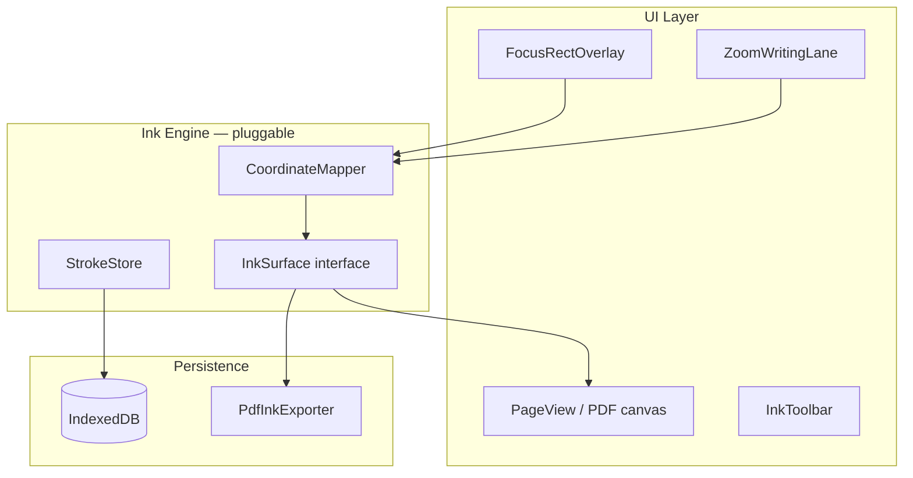

# GoodNotes-Style Zoom Writing Window — Future Feature

> **Status:** Post-MVP — not implemented. Architecture hooks only.  
> **Depends on:** [PDF Annotator workspace](./PDF_ANNOTATOR.md) (PDF pages + ink layer) inside [Library Pages](./LIBRARY_STRUCTURE.md).  
> **Target platform:** iPad Safari with Apple Pencil.

---

## Overview

A **zoom writing lane** (similar to GoodNotes) lets users handwrite translations and notes in a magnified strip at the bottom of the screen. Strokes render onto the **actual document page** in real time. A **blue focus rectangle** marks the active writing region; the lane auto-advances when the user writes near the edge, respecting **RTL** (Hebrew/Greek) or **LTR** (English) direction.

This complements structured textarea translation — it is for **ink-first** workflows ( parsing, glossing, margin translation ) on PDF or canvas-backed pages.

---

## User experience

```
┌──────────────────────────────────────────────┐
│  Document page (PDF or canvas)               │
│       ┌──────────────┐                       │
│       │ blue focus   │  ← mapped 1:1 to zoom │
│       │  rectangle   │     lane below        │
│       └──────────────┘                       │
├──────────────────────────────────────────────┤
│  ZOOM LANE (magnified ~2–3×)                 │
│  ┌────────────────────────────────────────┐  │
│  │  ····································  │  │  Apple Pencil ink
│  └────────────────────────────────────────┘  │
│  [ ◀ move focus ▶ ]   RTL ◉ LTR            │
└──────────────────────────────────────────────┘
```

### Behaviors

| Behavior | Detail |
|----------|--------|
| **Zoom lane** | Fixed dock at bottom (~25–35% viewport height); shows magnified slice of page under focus rect |
| **Blue focus rectangle** | `#007AFF` outline on page; draggable; persists position per page |
| **Stroke mapping** | Lane coordinates → inverse zoom transform → page ink layer |
| **Auto-advance** | When ink bounding box reaches trailing edge of focus area (85% threshold), shift focus rect one “step” in writing direction |
| **Hebrew / Greek mode** | Advance **right-to-left**; focus rect origin anchors on the right |
| **English mode** | Advance **left-to-right**; focus rect origin anchors on the left |
| **Manual move** | Drag focus rect on page, or nudge buttons in lane chrome |
| **Apple Pencil** | `pointerType === 'pen'`; pressure → stroke width; palm rejection via `touch-action: none` on ink surfaces |
| **Export** | Merge ink layer into PDF (burn-in) or export standalone ink PDF |

---

## Architecture

### Layer model



Aleph code should depend on **`InkSurface`** and **`FocusRegion`**, not on a specific canvas library. This allows swapping Perfect Freehand, custom Bézier storage, or a commercial SDK ink module later.

### Core interfaces (implemented as types only today)

See `lib/ink/types.ts` and `lib/ink/engine.ts`:

- `InkSurface` — mount, render strokes, hit-test, export
- `FocusRegion` — normalized page rect + writing direction
- `ZoomLaneController` — sync lane ↔ page, auto-advance logic
- `Stroke` — points with pressure, timestamp, tool, color

### Writing direction

```typescript
type WritingDirection = "ltr" | "rtl";

function writingDirectionForProject(project: {
  sourceLanguage: SourceLanguage;
  userOverride?: WritingDirection;
}): WritingDirection {
  // Hebrew + Greek default RTL; English override LTR
  // User can toggle in lane toolbar
}
```

Auto-advance checks **trailing edge** relative to direction:

- **LTR:** advance when `strokeBounds.maxX > focusRect.x + focusRect.width * 0.85`
- **RTL:** advance when `strokeBounds.minX < focusRect.x + focusRect.width * 0.15`

Advance step = `focusRect.width * 0.7` (overlap for continuity), clamped to page bounds.

---

## Integration with project types

### PDF projects (primary target)

Extends `PdfTranslationProject` from [PDF_ANNOTATOR.md](./PDF_ANNOTATOR.md):

```typescript
interface PdfTranslationProject {
  // ... existing fields ...
  ink?: {
    version: 1;
    pages: Record<number, PageInkData>;  // page index → strokes + focus
  };
}

interface PageInkData {
  strokes: Stroke[];
  focusRegions: FocusRegion[];  // usually one active; history for undo
  activeFocusId: string;
}
```

### Text projects (optional later)

Text-mode projects could use a **blank canvas page** per verse instead of PDF — same `InkSurface`, different backdrop. Not planned for first ink release.

---

## iPad Safari constraints

| Concern | Approach |
|---------|----------|
| **120 Hz / low latency** | Single canvas for lane; `requestAnimationFrame` batching; avoid React re-render per point |
| **Pencil vs touch** | Ignore `pointerType === 'touch'` on ink canvas when pencil recently active |
| **Zoom / scroll** | Lane uses fixed `touch-action: none`; page scroll disabled while lane focused |
| **Memory** | Simplify strokes (RDP / Perfect Freehand) before IDB save |
| **Safari canvas size limits** | Tile large pages if width × height × DPR exceeds limits (~16M pixels) |
| **Export** | Client-side: pdf-lib or PDF.js + embed PNG ink layers per page |

---

## Export to PDF

Two paths (architecture supports both):

1. **Burn-in export** — Rasterize ink per page → embed in PDF copy (pdf-lib)
2. **Annotation export** — Store strokes as PDF ink annotations (PDF 1.7) if engine supports it

MVP of this feature: **burn-in** (simpler, reliable on Safari).

```typescript
interface PdfInkExporter {
  export(project: PdfTranslationProject, blob: Blob): Promise<Blob>;
}
```

---

## Suggested implementation phases (post-MVP)

| Phase | Scope |
|-------|--------|
| **I1** | `InkSurface` + static page canvas; pencil strokes without zoom lane |
| **I2** | Focus rectangle overlay + manual drag |
| **I3** | Zoom lane with coordinate mapping |
| **I4** | Auto-advance LTR/RTL |
| **I5** | IDB persistence + reload |
| **I6** | PDF burn-in export |

Do **not** start until PDF workspace Phase B (verse pins) is stable — ink attaches to pages, not textareas.

---

## Relationship to other features

| Feature | Relationship |
|---------|--------------|
| **PDF Annotator** | Required foundation — page canvas + IndexedDB |
| **Text workspace** | Unchanged; no zoom lane on textarea MVP |
| **Aleph API** | Future: OCR on ink strokes, lemma lookup from handwritten glosses |
| **Commercial PDF SDK** | May replace raw canvas ink if Nutrient/PSPDFKit ink is adopted |

---

## Open decisions (when implementing)

1. Default direction: per `sourceLanguage`, or always user-selected?
2. Focus rect height: fixed mm on page, or user-resizable?
3. Lane zoom factor: fixed 2× or adaptive to Pencil stroke size?
4. Undo scope: per stroke, per focus session, or global?

---

## Files added for future compatibility (no runtime behavior)

| Path | Purpose |
|------|---------|
| `lib/ink/types.ts` | Stroke, FocusRegion, WritingDirection types |
| `lib/ink/engine.ts` | InkSurface, ZoomLaneController, PdfInkExporter interfaces |

These are **type-only contracts** — no UI, no canvas, no bundle impact beyond TypeScript erasure.
