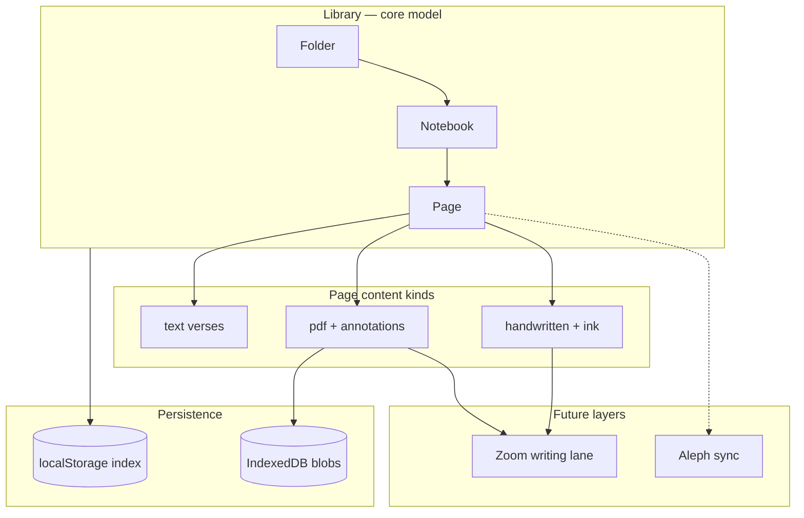

# Library Structure — Core Organizational Model

> **Status:** Approved direction — replaces flat “Archive” as the primary mental model.  
> **MVP today:** Flat projects in Archive map 1:1 to **Pages** during migration.  
> **Future:** Handwritten pages, PDF pages, GoodNotes zoom lane — all live inside **Pages**.

---

## Hierarchy

```
Library
├── Folder: Hebrew          (default, name editable)
│   ├── Notebook: Job       (name editable)
│   │   ├── Page: Job 1     (chapter / translation session)
│   │   ├── Page: Job 2
│   │   └── Page: Job 3
│   └── Notebook: Ruth
│       └── Page: Ruth 1
├── Folder: Greek           (default, name editable)
│   └── Notebook: John
│       ├── Page: John 1
│       ├── Page: John 2
│       └── Page: John 3
└── Folder: …               (user-created)
```

| Level | Examples | Editable | Contains |
|-------|----------|----------|----------|
| **Folder** | Hebrew, Greek, Exegesis | Yes | Notebooks |
| **Notebook** | Job, Ruth, John, Philippians | Yes | Pages (chapters) |
| **Page** | Job 1, John 3 | Yes | Translation content (text, PDF, or ink) |

---

## User-facing requirements

| Requirement | Design |
|-------------|--------|
| **Autosave all pages** | Debounced save per open page; library index updated on each save |
| **Remember last location** | `LibraryLocation` persisted: `{ folderId, notebookId, pageId }` |
| **Completion status** | Per-page: `not_started` → `in_progress` → `complete` from verse fill ratio |
| **Quick chapter navigation** | Notebook view: horizontal chapter strip + prev/next in workspace chrome |
| **Handwritten pages (future)** | `contentKind: "handwritten"` + `lib/ink/` |
| **Zoom writing lane (future)** | Enabled on PDF/handwritten pages — see [GOODNOTES_ZOOM.md](./GOODNOTES_ZOOM.md) |

---

## Data model

### Library root

```typescript
interface Library {
  version: 1;
  folders: FolderMeta[];
  lastLocation?: LibraryLocation;
}

interface LibraryLocation {
  folderId: FolderId;
  notebookId: NotebookId;
  pageId: PageId;
}
```

### Folder & notebook (metadata in library index)

```typescript
interface FolderMeta {
  id: FolderId;
  name: string;
  sortOrder: number;
  isDefault?: boolean;   // seeded Hebrew / Greek
  createdAt: string;
  updatedAt: string;
}

interface NotebookMeta {
  id: NotebookId;
  folderId: FolderId;
  name: string;
  sortOrder: number;
  createdAt: string;
  updatedAt: string;
}
```

### Page (content + index entry)

Each **Page** is the successor to today’s `TranslationProject`:

```typescript
type PageContentKind = "text" | "pdf" | "handwritten";

interface PageIndexEntry {
  id: PageId;
  notebookId: NotebookId;
  folderId: FolderId;
  name: string;              // "Job 1"
  sortOrder: number;
  contentKind: PageContentKind;
  sourceLanguage: SourceLanguage;
  updatedAt: string;
  completion: PageCompletion;
}

interface Page extends PageIndexEntry {
  createdAt: string;
  title: string;             // editable display title (may match name)
  verses: Verse[];           // text mode
  passageRef?: string;
  pdf?: PdfPageRef;          // future — PDF_ANNOTATOR.md
  ink?: InkDocument;         // future — GOODNOTES_ZOOM.md
}
```

### Completion

```typescript
interface PageCompletion {
  status: "not_started" | "in_progress" | "complete";
  translatedCount: number;
  totalVerses: number;
  /** 0–100, floor of translatedCount / totalVerses */
  percent: number;
}
```

Rules:

- `not_started` — 0 verses translated
- `in_progress` — 1 … total−1 translated, or any notes without full translation
- `complete` — all verses have non-empty `translation` (notes optional)

---

## Storage layout

| Key / store | Contents |
|-------------|----------|
| `aleph:library` | `Library` root (folders, lastLocation) |
| `aleph:notebook:{id}` | `NotebookMeta` |
| `aleph:page:{id}` | Full `Page` JSON |
| `aleph:pages:index` | `PageIndexEntry[]` for fast notebook/library views |
| IndexedDB `aleph:pdf:{pageId}` | PDF blobs (future) |

MVP migration: existing `aleph:project:{id}` entries migrate to `aleph:page:{id}` under a **“Imported”** notebook per language folder.

---

## Default library seed

On first launch (empty library):

```typescript
const DEFAULT_FOLDERS = [
  { name: "Hebrew", isDefault: true, sortOrder: 0 },
  { name: "Greek",  isDefault: true, sortOrder: 1 },
];
```

No notebooks or pages until the user creates them or migrates MVP projects.

**Empty notebooks are allowed** — users can create placeholder notebooks (e.g. “Philippians” before the semester starts) with zero pages.

---

## Navigation & routes (target)

| Route | Screen |
|-------|--------|
| `/library` | Folder list (Hebrew, Greek, + custom) |
| `/library/[folderId]` | Notebooks in folder (**drag to reorder**) |
| `/library/[folderId]/[notebookId]` | Pages/chapters with completion badges |
| `/library/.../[pageId]` | Workspace (text / PDF / ink) |

**MVP compatibility:** `/workspace/[id]` redirects to library path after migration, or aliases the same `PageId`.

### Quick chapter navigation (workspace chrome)

```
[ ◀ Job 1 ]  Job 2  [ Job 3 ▶ ]
     ↑ current page (completion dot)
```

- Swipe or tap adjacent chapter
- Updates `lastLocation`
- Autosave flushes previous page before navigation

---

## Architecture diagram



---

## `LibraryStore` interface

Implementation target in `lib/library/store.ts` (interface only today):

```typescript
interface LibraryStore {
  getLibrary(): Library;
  listFolders(): FolderMeta[];
  createFolder(name: string): FolderMeta;
  renameFolder(id: FolderId, name: string): void;

  listNotebooks(folderId: FolderId): NotebookMeta[];
  createNotebook(folderId: FolderId, name: string): NotebookMeta;
  renameNotebook(id: NotebookId, name: string): void;
  reorderNotebooks(folderId: FolderId, orderedIds: NotebookId[]): void;

  listPages(notebookId: NotebookId): PageIndexEntry[];
  getPage(id: PageId): Page | null;
  savePage(page: Page): void;
  deletePage(id: PageId): void;

  getLastLocation(): LibraryLocation | null;
  setLastLocation(loc: LibraryLocation): void;

  computeCompletion(page: Page): PageCompletion;
}
```

Current MVP `lib/storage/projects.ts` functions map to:

| MVP | Library |
|-----|---------|
| `createProject()` | `createPage(notebookId, …)` |
| `getProject()` | `getPage()` |
| `saveProject()` | `savePage()` |
| `listProjects()` | `listPages()` across all notebooks OR legacy archive view |
| `getLastOpenedId()` | `getLastLocation().pageId` |

---

## UI screens (replacing Archive-centric flow)

### Home (revised)

- **Library** — browse folders (primary)
- **Continue** — jump to `lastLocation`
- **New Page** — pick folder → notebook → name chapter

Archive becomes **Library**; “Open Saved Translation” opens last notebook or folder picker.

### Folder notebook list

- Notebook name (editable)
- Page count (may be **0** — empty notebooks allowed)
- **Drag handle** to reorder notebooks within the folder (touch-friendly, iPad-first)
- Tap to open notebook page list

Uses `@dnd-kit/core` or native drag events; on drop, call `reorderNotebooks(folderId, orderedIds)` and autosave `sortOrder`.

### Notebook page list

Each row:

- Chapter name (`Job 1`)
- Completion badge (empty / partial / checkmark)
- Last edited relative time
- Content kind icon (text / PDF / ink)

---

## Migration from MVP flat archive

1. On upgrade, read `aleph:projects:index`
2. For each project, infer folder from `sourceLanguage` → Hebrew or Greek
3. Create notebook **“Imported”** in each folder if needed
4. Copy project → page with same `id` (preserve URLs)
5. Write `aleph:library` + `aleph:pages:index`
6. Keep reading old keys for one release, then remove

---

## Phased rollout

| Phase | Deliverable |
|-------|-------------|
| **L0** | Types + `LibraryStore` interface + this doc (current) |
| **L1** | Seed Hebrew/Greek folders; library routes; page CRUD; **notebook drag-reorder** |
| **L2** | Migrate MVP projects; replace Archive with Library UI |
| **L3** | Completion badges + chapter quick-nav + last location |
| **L4** | PDF pages in notebooks |
| **L5** | Handwritten + zoom lane pages |

---

## Cross-references

- [PROJECT_PLAN.md](./PROJECT_PLAN.md) — MVP baseline
- [PDF_ANNOTATOR.md](./PDF_ANNOTATOR.md) — `contentKind: "pdf"`
- [GOODNOTES_ZOOM.md](./GOODNOTES_ZOOM.md) — ink on PDF/handwritten pages

---

## Approved decisions

1. **Empty notebooks:** Allowed — placeholders with zero pages are fine.
2. **Notebook reorder:** Drag-and-drop within a folder in **L1** (iPad-friendly drag handles).
3. **Folder / page reorder:** Not in L1; pages may get reorder in L3 with chapter nav work.

## Open decisions

1. **Duplicate page** (copy chapter to new page)?
2. **Complete** manually overridable, or strictly verse-fill algorithm?
