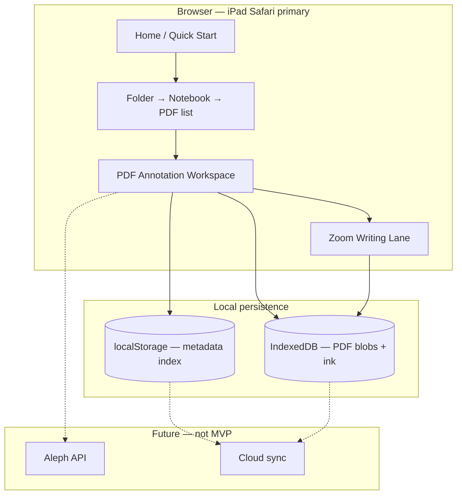

# Aleph Translate — Project Plan

> **Status:** Revised product vision — **PDF-first architecture approved for implementation.**  
> **Supersedes:** Text-paste MVP plan (`cursor/initial-mvp-2f95`). v1.0 shipped a text workspace; the product pivots to PDF annotation before further feature work.  
> **Related:** [PDF_ANNOTATOR.md](./PDF_ANNOTATOR.md) · [GOODNOTES_ZOOM.md](./GOODNOTES_ZOOM.md) · [LIBRARY_STRUCTURE.md](./LIBRARY_STRUCTURE.md) _(requires update to match this plan)_

---

## Product vision

Aleph Translate is an **iPad/Safari-first PDF annotation and translation application**. A seminary student receives a translation assignment as a PDF, completes all handwritten translation work inside Aleph Translate, and submits the exported PDF — **without needing GoodNotes or a separate notebook app**.

**Stack:** Next.js (App Router) · TypeScript · Tailwind CSS · PDF.js · IndexedDB · Vercel deployment

### What Aleph Translate is

| Yes | No |
|-----|-----|
| PDF import and annotation | Blank notebook pages |
| Folder → Notebook → Annotated PDF organization | A generic note-taking or page-based notebook app |
| Apple Pencil ink on the PDF | Verse-by-verse textarea as the primary workspace |
| GoodNotes-style zoom writing lane | Empty writing canvases with no PDF underneath |
| Typed and handwritten notes on the document | Logos paste-as-primary workflow |
| Autosave and annotated PDF export | Flashcards, drills, Quizlet, Aleph API (future only) |

### Design goal

> The **PDF is the working surface.** The notebook is only an organizational container for related PDFs.

---

## Core model

```
Folder
  └── Notebook          ← container for related annotated PDFs (NOT blank pages)
        └── Annotated PDF   ← imported PDF + ink + annotations + export state
```

### Terminology

| Term | Meaning | Example |
|------|---------|---------|
| **Folder** | Top-level organization by subject, language, or project type | Hebrew, Greek, Hebrew Exegesis, Research |
| **Notebook** | A **group of related PDFs** — assignments, chapters, or papers in one unit | Job, John, Job Paper Research |
| **Annotated PDF** | One imported PDF file plus all user ink, highlights, typed notes, and zoom-lane strokes | Job 1 Assignment.pdf |

**Important:** A notebook is **not** a blank notebook with empty pages. It does not contain “pages” as a writing surface. It contains **PDF documents**. Do **not** create blank notebook pages for MVP.

### Examples

```
Folder: Hebrew
  Notebook: Job
    PDF: Job 1 Assignment
    PDF: Job 2 Assignment

Folder: Greek
  Notebook: John
    PDF: John 1 Assignment
    PDF: John 2 Assignment

Folder: Hebrew Exegesis
  Notebook: Job Paper Research
    PDF: Article 1
    PDF: Article 2

Folder: Research
  Notebook: Articles
    PDF: Article A
    PDF: Article B
```

Default seeded folders may include **Hebrew** and **Greek**; users add folders and notebooks freely. An **Inbox** folder (optional) can hold PDFs imported via Quick Start before the user files them into a notebook.

---

## Primary workflow

1. **Import a PDF** — Quick Start or “Add PDF” inside a notebook.
2. **Organize** — Place PDFs into Folder → Notebook (or file from Inbox later).
3. **Open a folder** — Browse top-level library.
4. **Open a notebook** — See related annotated PDFs in that group.
5. **Open a PDF** — Enter the annotation workspace; the PDF fills the screen.
6. **Annotate** — Apple Pencil highlights, ink, typed text boxes directly on the PDF.
7. **Write with zoom lane** — GoodNotes-style magnified writing strip for handwritten translation and notes; ink maps onto the PDF.
8. **Autosave** — Annotations and ink persist locally on every change.
9. **Reopen and continue** — Last location remembered; resume exactly where the student left off.
10. **Export** — Burn annotations into a PDF for professor submission.

```
Import PDF → Folder → Notebook → Open PDF → Annotate → Zoom lane → Autosave → Export
```

---

## Defining feature: GoodNotes-style zoom writing lane

The zoom writing window is a **core feature**, not a post-MVP add-on. See [GOODNOTES_ZOOM.md](./GOODNOTES_ZOOM.md) for full behavior.

| Behavior | Detail |
|----------|--------|
| PDF remains visible | Full page shown above the lane |
| Zoom writing lane | Magnified strip (~25–35% viewport) at bottom for Apple Pencil input |
| Dual ink rendering | Strokes appear in the lane **and** on the PDF in real time |
| Blue focus rectangle | `#007AFF` outline marks the active writing region on the PDF |
| Auto-advance | Focus shifts when the user writes near the trailing edge |
| Hebrew / Greek | Right-to-left advance mode |
| English | Left-to-right advance mode |

Implementation depends on a PDF canvas + ink layer; the lane shares one coordinate map with the page ink surface.

---

## Core features (MVP scope)

| Feature | Priority | Notes |
|---------|----------|-------|
| PDF import | Required | File picker; validate type/size |
| Folder organization | Required | Create, rename, reorder folders |
| Notebook containers | Required | Group related PDFs; no blank pages |
| PDF viewer + annotation | Required | Pen, highlighter, eraser, text box |
| Apple Pencil support | Required | Pressure, palm rejection on ink surfaces |
| Zoom writing lane | Required | Defining feature — ship with MVP |
| Typed notes on PDF | Required | Text annotations on document |
| Handwritten notes (ink) | Required | Direct on PDF + via zoom lane |
| Autosave | Required | Debounced persist; save indicator |
| Reopen / last location | Required | Resume last open PDF |
| PDF export | Required | Annotated PDF for submission |
| iPad Safari optimization | Required | Safe areas, touch targets, `visualViewport` |

### Explicitly out of scope (MVP)

- Blank notebook pages or standalone writing canvases
- Text-paste → verse-block translation as primary flow
- Flashcards, vocabulary drills, Quizlet export
- Aleph API integration (hooks only)
- Cloud sync / auth
- OCR or automatic verse detection from PDFs

---

## Architecture

### High-level diagram



### Storage strategy

| Data | Store | Key pattern |
|------|-------|-------------|
| Library tree (folders, notebooks, PDF index) | `localStorage` | `aleph:library`, `aleph:notebooks`, `aleph:pdfs:index` |
| PDF metadata + annotation JSON | `localStorage` | `aleph:pdf:{id}` |
| PDF binary files | **IndexedDB** | `aleph:pdf-blob:{id}` |
| Ink strokes (per page) | IndexedDB or JSON in PDF record | `aleph:ink:{pdfId}` |
| Last location | `localStorage` | `aleph:library.lastLocation` |

`localStorage` cannot hold PDF binaries. **IndexedDB is required** before PDF support ships.

Upload limit (proposed): **25 MB per PDF** with a friendly error above quota.

### Proposed directory structure

```
aleph-translate/
├── app/
│   ├── page.tsx                          # Home
│   ├── quick-start/page.tsx              # Import PDF → Inbox
│   └── library/
│       ├── page.tsx                      # Folder list
│       ├── [folderId]/page.tsx           # Notebooks in folder
│       ├── [folderId]/[notebookId]/page.tsx      # PDF list in notebook
│       └── [folderId]/[notebookId]/[pdfId]/page.tsx  # Annotation workspace
├── components/
│   ├── layout/                           # AppShell, back, home
│   ├── library/                          # FolderList, NotebookList, PdfList
│   └── pdf/
│       ├── PdfUpload.tsx
│       ├── PdfWorkspace.tsx              # Viewer + toolbar + autosave
│       ├── PdfViewer.tsx                 # pdf.js, dynamic import, ssr: false
│       ├── PdfAnnotationToolbar.tsx
│       ├── PdfExportButton.tsx
│       └── zoom/
│           ├── ZoomWritingLane.tsx
│           └── FocusRectOverlay.tsx
├── lib/
│   ├── library/                          # Folder / notebook / PDF CRUD
│   ├── storage/
│   │   ├── keys.ts
│   │   └── indexedDb.ts                  # PDF blob CRUD
│   ├── pdf/
│   │   ├── types.ts                      # AnnotatedPdf, annotations
│   │   ├── export.ts                     # Burn-in annotations → PDF
│   │   └── engine.ts                     # Pluggable PdfEngine interface
│   ├── ink/
│   │   ├── types.ts
│   │   └── engine.ts                     # InkSurface + coordinate map
│   └── aleph/
│       └── textCleanup.ts                # Future text-layer normalization
└── hooks/
    ├── useLibraryInit.ts
    ├── useAnnotatedPdf.ts
    ├── useAutosave.ts
    └── useZoomLane.ts
```

**SSR note:** PDF.js and canvas ink layers load via `next/dynamic({ ssr: false })`.

### Routing

| Route | Purpose |
|-------|---------|
| `/` | Home — Import PDF, Library, Continue last PDF |
| `/quick-start` | Import PDF → save to Inbox → open workspace |
| `/library` | Folder list |
| `/library/[folderId]` | Notebooks in folder |
| `/library/[folderId]/[notebookId]` | Annotated PDFs in notebook (+ Add PDF) |
| `/library/[folderId]/[notebookId]/[pdfId]` | **PDF annotation workspace** |

Legacy routes (`/new`, `/workspace/[id]`, `/archive`, text “page” URLs) redirect or remain read-only until migration removes them.

---

## Data model

### Identifiers

```typescript
type FolderId = string;
type NotebookId = string;
type PdfId = string;
```

### Library hierarchy

```typescript
interface Library {
  version: 2;
  folders: FolderMeta[];
  inbox?: { folderId: FolderId; notebookId: NotebookId };
  lastLocation?: { folderId: FolderId; notebookId: NotebookId; pdfId: PdfId };
}

interface FolderMeta {
  id: FolderId;
  name: string;           // e.g. "Hebrew", "Hebrew Exegesis"
  sortOrder: number;
  isDefault?: boolean;
  isInbox?: boolean;
  createdAt: string;
  updatedAt: string;
}

interface NotebookMeta {
  id: NotebookId;
  folderId: FolderId;
  name: string;           // e.g. "Job", "Job Paper Research"
  sortOrder: number;
  createdAt: string;
  updatedAt: string;
}
```

### Annotated PDF (the working unit)

```typescript
interface AnnotatedPdfIndexEntry {
  id: PdfId;
  notebookId: NotebookId;
  folderId: FolderId;
  name: string;           // Display name, e.g. "Job 1 Assignment"
  fileName: string;       // Original upload name
  pageCount: number;
  sortOrder: number;
  updatedAt: string;
  annotationCount?: number;
}

interface AnnotatedPdf extends AnnotatedPdfIndexEntry {
  createdAt: string;
  blobKey: string;        // IndexedDB key for source PDF bytes
  writingDirection: "rtl" | "ltr";  // Zoom lane advance mode
  annotations: PdfAnnotation[];
  /** Per-page ink stored inline or referenced by page number */
  inkByPage: Record<number, InkStroke[]>;
}

type PdfAnnotation =
  | { id: string; type: "highlight"; page: number; rects: NormalizedRect[]; color: string }
  | { id: string; type: "ink"; page: number; strokes: InkStroke[] }
  | { id: string; type: "text"; page: number; rect: NormalizedRect; content: string; fontSize: number }
  | { id: string; type: "freetext"; page: number; point: NormalizedPoint; content: string };

interface NormalizedRect {
  x: number; y: number; w: number; h: number; // 0–1 relative to page
}
```

There is **no** `Page` entity with blank content. There is **no** `verses[]` array on PDF documents in MVP. Optional typed side notes attach as PDF text annotations.

### Zoom lane state (per open session)

```typescript
interface ZoomLaneState {
  enabled: boolean;
  focusRect: NormalizedRect;
  zoomScale: number;      // e.g. 2.5
  writingDirection: "rtl" | "ltr";
}
```

---

## Screens

### 1. Home (`/`)

- **Import PDF** → `/quick-start`
- **Library** → `/library`
- **Continue** → last opened annotated PDF (if any)

### 2. Quick Start — Import PDF (`/quick-start`)

- File picker (`.pdf` only)
- Optional display name
- Saves PDF to **Inbox** notebook; user files into Folder → Notebook later
- On success → open annotation workspace immediately

**No text paste. No blank page creation.**

### 3. Library — Folders (`/library`)

- List folders (Hebrew, Greek, Inbox, user-created)
- Create / rename folder
- Tap folder → notebooks

### 4. Folder — Notebooks (`/library/[folderId]`)

- List notebooks in folder (Job, John, …)
- Create / rename / reorder notebooks
- Tap notebook → PDF list

### 5. Notebook — Annotated PDFs (`/library/[folderId]/[notebookId]`)

- List imported PDFs in this notebook
- **Add PDF** — import another PDF into this notebook
- Tap PDF → annotation workspace
- Empty state: “Import a PDF to start” (not “Create page”)

### 6. PDF annotation workspace (`/library/.../[pdfId]`)

Primary working surface:

```
┌──────────────────────────────────────────────┐
│ Toolbar: pen · highlight · text · eraser ·   │
│          export · writing direction RTL/LTR   │
├──────────────────────────────────────────────┤
│                                              │
│   PDF page (scroll / pinch zoom)             │
│        ┌──────────────┐                      │
│        │ blue focus   │  ← zoom lane target │
│        │  rectangle   │                      │
│        └──────────────┘                      │
│                                              │
├──────────────────────────────────────────────┤
│  ZOOM WRITING LANE (GoodNotes-style)         │
│  ········································    │
└──────────────────────────────────────────────┘
```

- All annotation tools operate on the PDF
- Zoom lane docked at bottom; toggled on by default for translation work
- Autosave indicator in header
- **Export annotated PDF** in toolbar

---

## UI / UX guidelines (iPad-first)

| Guideline | Implementation |
|-----------|----------------|
| Touch targets | Minimum 44×44 pt on all tools and list rows |
| Apple Pencil | `pointerType === 'pen'`; pressure → stroke width; `touch-action: none` on ink |
| Safe areas | `env(safe-area-inset-*)` on header, lane, and bottom chrome |
| Keyboard / viewport | `visualViewport` listener so zoom lane does not collapse when iPad keyboard opens |
| PDF performance | Lazy page render; do not load all pages into DOM at once |
| Dark mode | Tailwind `dark:` variants on chrome; PDF page stays white unless user preference added later |
| Safari | Use `min-h-dvh`; test pinch-zoom + ink on real iPad hardware |

---

## Implementation phases

Implementation starts **after** this plan is approved. Order:

### Phase 1 — Foundation

1. Revise `lib/library/types` — `AnnotatedPdf` replaces text `Page`; remove blank-page concepts
2. IndexedDB layer for PDF blobs
3. Quick Start → PDF import (replace text paste)
4. Library routes: Folder → Notebook → PDF list
5. Basic PDF viewer (pdf.js, dynamic import)

### Phase 2 — Annotation + autosave

6. Pen, highlighter, text box, eraser on PDF canvas overlay
7. Autosave annotations + ink to IndexedDB / localStorage
8. Last location + Continue on home
9. Migrate or retire v1 text workspace (read-only or redirect)

### Phase 3 — Zoom writing lane (defining feature)

10. Focus rectangle overlay on PDF
11. Zoom lane component with coordinate mapping
12. RTL / LTR auto-advance modes
13. Apple Pencil QA on iPad Safari

### Phase 4 — Export + polish

14. Export annotated PDF (burn-in ink + highlights)
15. Delete PDF + blob cleanup
16. Empty states, quota errors, upload size warnings
17. Update `LIBRARY_STRUCTURE.md` and README to match this plan

### PDF engine spike

Evaluate Fresh Air PDF vs pdf-reader-js vs raw PDF.js behind a `PdfEngine` interface — see [PDF_ANNOTATOR.md](./PDF_ANNOTATOR.md). Spike on iPad Safari before committing.

---

## Migration from v1 (text workspace)

v1.0 shipped Folder → Notebook → **text Page** with verse blocks. That model is **deprecated**:

| v1 (deprecated) | v2 (target) |
|-----------------|-------------|
| Paste text → verses | Import PDF |
| `Page` with `verses[]` | `AnnotatedPdf` with annotations + ink |
| Textarea translation workspace | PDF annotation workspace + zoom lane |
| `contentKind: "text" \| "pdf" \| "handwritten"` | PDF-only working surface; `"handwritten"` removed as separate kind |
| Completion from verse fill ratio | Progress from annotation activity or manual status (TBD) |

Existing text pages may remain accessible read-only until users re-import source material as PDF, or a one-time export prompt is shown.

---

## Future Aleph integration (hooks only)

| Hook | Location | Future behavior |
|------|----------|-----------------|
| Text cleanup | `lib/aleph/textCleanup.ts` | Normalize text extracted from PDF text layer |
| Lemma lookup | `lib/aleph/` | Select text in PDF → morphology panel |
| Sync | `lib/aleph/sync.ts` | Push annotated PDFs + metadata to Aleph cloud |

No API routes in MVP.

---

## Decisions (approved)

1. **PDF-first product** — Aleph Translate is not a blank notebook or page-based writing app.
2. **Notebook = PDF container** — Notebooks group related annotated PDFs only.
3. **No blank pages in MVP** — Every working surface is an imported PDF.
4. **Zoom writing lane is core** — Ships with MVP, not deferred.
5. **IndexedDB for PDF binaries** — Required; localStorage for metadata only.
6. **Export annotated PDF** — Required for seminary submission workflow.
7. **Folder → Notebook → Annotated PDF** — Canonical hierarchy; see examples above.

---

## Open questions

1. **PDF engine:** Fresh Air PDF first spike, or raw PDF.js + custom overlay?
2. **Inbox filing:** Require notebook assignment on import, or always allow Quick Start → Inbox?
3. **v1 text pages:** Read-only forever, auto-migrate, or hard delete on v2 launch?
4. **Completion status:** Keep per-PDF progress badge, or drop until annotation metrics defined?
5. **Max PDF size:** Confirm 25 MB upload cap for MVP.

---

## References

| Document | Role |
|----------|------|
| [PDF_ANNOTATOR.md](./PDF_ANNOTATOR.md) | PDF viewer, annotation tools, engine evaluation |
| [GOODNOTES_ZOOM.md](./GOODNOTES_ZOOM.md) | Zoom lane behavior, focus rect, RTL/LTR advance |
| [LIBRARY_STRUCTURE.md](./LIBRARY_STRUCTURE.md) | **To be updated** — currently describes text Pages; align with this plan |
