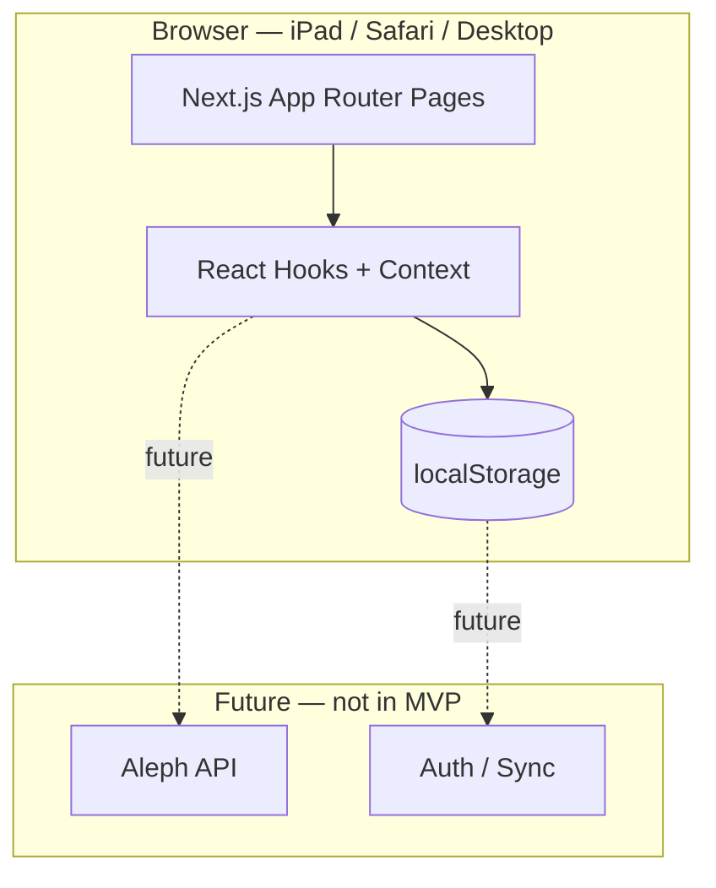

# Aleph Translate — Project Plan (MVP)

> **Status:** Approved — MVP implemented on `cursor/initial-mvp-2f95`.

## Overview

Aleph Translate is an iPad/Safari-first web application for translating Hebrew and Greek biblical text. Users paste source text, work verse-by-verse in a translation workspace, and reopen saved projects from a local archive. The MVP stores everything in the browser (no backend, no Aleph integration).

**Stack:** Next.js (App Router) · TypeScript · Tailwind CSS · Vercel deployment

**Explicitly out of scope for MVP:** flashcards, vocabulary study, parsing drills, Quizlet export, Aleph API integration.

**Next proposed enhancement:** Embedded PDF annotator workspace — see [PDF_ANNOTATOR.md](./PDF_ANNOTATOR.md).

**Post-MVP ink:** GoodNotes-style zoom writing lane — see [GOODNOTES_ZOOM.md](./GOODNOTES_ZOOM.md).

**Core organizational model:** Folder → Notebook → Page library — see [LIBRARY_STRUCTURE.md](./LIBRARY_STRUCTURE.md).

---

## Architecture

### High-level diagram



### Directory structure (proposed)

```
aleph-translate/
├── app/
│   ├── layout.tsx              # Root layout, fonts, viewport meta
│   ├── page.tsx                # Home
│   ├── globals.css             # Tailwind + iPad touch targets
│   ├── new/
│   │   └── page.tsx            # New Translation (paste + clean)
│   ├── workspace/
│   │   └── [id]/
│   │       └── page.tsx        # Translation Workspace
│   └── archive/
│       └── page.tsx            # Saved projects list
├── components/
│   ├── layout/
│   │   ├── AppShell.tsx        # Header, nav, safe-area padding
│   │   └── NavBar.tsx          # Home / Archive shortcuts
│   ├── home/
│   │   └── HomeActions.tsx     # Primary action cards
│   ├── translation/
│   │   ├── SourceInput.tsx     # Paste area + Clean Text
│   │   ├── VerseBlock.tsx      # Original + translation + notes
│   │   └── WorkspaceToolbar.tsx# Save status, back nav
│   └── archive/
│       └── ProjectList.tsx     # Sortable list, reopen / delete
├── lib/
│   ├── storage/
│   │   ├── keys.ts             # localStorage key constants
│   │   ├── projects.ts         # CRUD for TranslationProject
│   │   └── autosave.ts         # Debounced persist helper
│   ├── text/
│   │   ├── clean.ts            # Normalize whitespace, line breaks
│   │   └── parseVerses.ts      # Split pasted text into verses
│   └── types/
│       └── project.ts          # Shared TypeScript types
├── hooks/
│   ├── useProject.ts           # Load/save single project
│   ├── useAutosave.ts          # Debounced write + status
│   └── useProjectsList.ts      # Archive index
└── public/
    └── (icons / manifest for PWA-ready later)
```

### Design principles

| Principle | Implementation |
|-----------|----------------|
| iPad/Safari-first | Minimum 44px touch targets, `-webkit-tap-highlight-color`, safe-area insets, no hover-only interactions |
| Responsive desktop | Max-width content column (~720px workspace), wider archive grid on `md+` |
| Offline-capable foundation | All state in `localStorage`; no network required for MVP |
| Vercel-ready | Static-friendly App Router pages, `output: 'standalone'` optional later |
| Minimal scope | No auth, no API routes, no database in MVP |

### Routing

| Route | Page | Purpose |
|-------|------|---------|
| `/` | Home | Entry point, three primary actions |
| `/new` | New Translation | Paste source text, clean, start |
| `/workspace/[id]` | Translation Workspace | Verse-by-verse editing |
| `/archive` | Archive | List and reopen saved projects |

Navigation uses Next.js `<Link>` and `useRouter` for programmatic redirects after creating a project.

### State & persistence

1. **Project creation** — User pastes text on `/new` → `parseVerses()` splits into verse array → new `TranslationProject` written to `localStorage` → redirect to `/workspace/[id]`.
2. **Autosave** — `useAutosave` debounces (300–500 ms) writes on any translation or notes change; shows "Saving…" / "Saved" indicator.
3. **Archive index** — Derived from a project index key (`aleph:projects:index`) storing `{ id, title, updatedAt, verseCount }[]` for fast listing without loading full projects.

No server components fetch data in MVP; pages are client components where interactivity is required, with a thin server layout for metadata and fonts.

---

## Screens

### 1. Home (`/`)

**Purpose:** Launch pad for the three core flows.

**Layout:**
- App title and short subtitle
- Three large action cards (stacked on iPad portrait, row on desktop):
  - **New Translation** → `/new`
  - **Open Saved Translation** → `/archive` (same destination as Archive; label emphasizes reopening)
  - **Archive** → `/archive`
- Optional footer: last-opened project quick link (if any)

**Interactions:** Tap/click cards only; no forms on this screen.

---

### 2. New Translation (`/new`)

**Purpose:** Capture raw Hebrew or Greek text and prepare it for the workspace.

**Layout:**
- Large multiline textarea (RTL-friendly for Hebrew via `dir="auto"`)
- Character/verse preview count after parsing
- **Clean Text** — normalizes whitespace, collapses blank lines, trims edges (does not alter Hebrew/Greek characters)
- **Start Translation** — disabled until non-empty text; creates project and navigates to workspace

**Validation:**
- Empty input → button disabled + inline hint
- Very long paste → allowed; verse split handles line-based input

**Flow:**
```
Paste → (optional Clean) → Start → parseVerses → save project → /workspace/[id]
```

---

### 3. Translation Workspace (`/workspace/[id]`)

**Purpose:** Primary working surface — one block per verse.

**Layout (per verse):**
```
┌─────────────────────────────────────┐
│ Verse N — Original (source language)│
│  [read-only, serif-friendly font]   │
├─────────────────────────────────────┤
│ Translation                         │
│  [editable textarea]                │
├─────────────────────────────────────┤
│ Notes                               │
│  [editable textarea, smaller]       │
└─────────────────────────────────────┘
```

**Chrome:**
- Top bar: back to Home, project title (editable inline or truncated), autosave status
- Scrollable verse list with comfortable spacing for Apple Pencil / finger
- Sticky save indicator (not sticky verse headers in MVP)

**Behavior:**
- All edits autosave to `localStorage`
- Missing/invalid `id` → redirect to `/archive` with toast-style message
- Desktop: same layout, slightly wider max-width

---

### 4. Archive (`/archive`)

**Purpose:** Browse and reopen saved translation projects.

**Layout:**
- List of cards/rows: title (first line or "Untitled"), verse count, last modified (relative time)
- Tap row → `/workspace/[id]`
- Swipe or long-press delete (iPad: explicit delete button on each row for clarity)
- Empty state: illustration + link to New Translation

**Sorting:** Most recently updated first.

---

## Data Model

### TypeScript types

```typescript
/** Unique project identifier (crypto.randomUUID) */
type ProjectId = string;

/** Single verse unit in a project */
interface Verse {
  index: number;           // 0-based order in project
  original: string;        // Source Hebrew/Greek text
  translation: string;     // User's translation (starts empty)
  notes: string;           // User notes (starts empty)
}

/** Full translation project persisted in localStorage */
interface TranslationProject {
  id: ProjectId;
  title: string;           // Default: first 40 chars of original or "Untitled"
  sourceLanguage: 'hebrew' | 'greek' | 'unknown';  // Heuristic from first char block
  createdAt: string;       // ISO 8601
  updatedAt: string;       // ISO 8601
  verses: Verse[];
}

/** Lightweight entry for archive list (stored in index) */
interface ProjectIndexEntry {
  id: ProjectId;
  title: string;
  updatedAt: string;
  verseCount: number;
}
```

### localStorage keys

| Key | Value |
|-----|-------|
| `aleph:projects:index` | `ProjectIndexEntry[]` |
| `aleph:project:{id}` | `TranslationProject` JSON |
| `aleph:lastOpened` | `ProjectId` (optional, for Home quick link) |

### CRUD operations

| Operation | Function | Notes |
|-----------|----------|-------|
| Create | `createProject(text)` | Parse, persist, update index |
| Read | `getProject(id)` | Returns null if missing |
| Update | `saveProject(project)` | Updates `updatedAt`, syncs index entry |
| Delete | `deleteProject(id)` | Removes blob + index entry |
| List | `listProjects()` | Reads index, sorted by `updatedAt` desc |

### Verse parsing (MVP heuristic)

- Split on newlines; drop empty lines after trim
- Each non-empty line = one verse
- Future: reference-aware parsing (e.g. `Gen 1:1`) deferred

### Storage limits

- `localStorage` ~5 MB per origin; MVP shows a friendly error if `QuotaExceededError` occurs
- No compression in MVP

---

## UI / UX Guidelines (iPad-first)

- **Typography:** System UI for chrome; serif stack for original text (e.g. `Noto Serif Hebrew`, `Gentium Plus` via Google Fonts or self-hosted)
- **Touch targets:** Minimum 44×44 pt for buttons and list rows
- **Safe areas:** `env(safe-area-inset-*)` on header and bottom padding
- **Dark mode:** Respect `prefers-color-scheme` via Tailwind `dark:` variants
- **Keyboard (iPad):** Textareas scroll into view; no custom keyboard in MVP
- **Safari quirks:** Avoid `100vh` alone; use `min-h-dvh` where supported

---

## Future Aleph Integration Points

These are **documented hooks only** — not built in MVP. Code should use thin abstractions so Aleph can plug in later without rewriting the workspace.

### 1. Source text enrichment

| Hook | Location | Future behavior |
|------|----------|-----------------|
| `fetchLemmaAnalysis(verse)` | `lib/aleph/` (stub) | Return lemmas, morphology from Aleph |
| Verse metadata | Extend `Verse` with optional `alephRef?: string` | Link to Aleph passage ID |

**UI placeholder:** Optional collapsed "Aleph insights" panel below each verse (hidden/disabled in MVP).

### 2. Authentication & sync

| Hook | Location | Future behavior |
|------|----------|-----------------|
| `AuthProvider` | `components/providers/` | Aleph OAuth or API key |
| `syncProject(project)` | `lib/aleph/sync.ts` | Push/pull projects to Aleph cloud |

**MVP:** No provider; local-only storage interface (`ProjectsStore`) swappable for remote store.

### 3. Vocabulary & study (out of MVP, planned interfaces)

| Feature | Integration point |
|---------|-------------------|
| Flashcards | Export `Verse` + lemma list → Aleph deck API |
| Vocabulary study | Spaced repetition from saved `notes` + Aleph lexicon |
| Parsing drills | Morphology from Aleph → drill generator |
| Quizlet export | Transform `Verse[]` + glossary to Quizlet format |

**Abstraction:** `lib/export/adapters.ts` with no-op stubs in MVP.

### 4. Suggested API surface (future)

```
GET  /api/aleph/lemma?text=...     # Proxy to Aleph (server-side key)
POST /api/projects/sync            # Optional cloud backup
GET  /api/user/vocabulary          # Cross-device vocab
```

MVP has **no** `app/api/` routes.

### 5. Data model extensions (future)

```typescript
interface Verse {
  // MVP fields ...
  alephLemmaIds?: string[];
  morphology?: AlephMorphology[];
}

interface TranslationProject {
  // MVP fields ...
  alephDocumentId?: string;
  syncedAt?: string;
}
```

---

## MVP Implementation Checklist

After approval, implementation order:

1. **Scaffold** — `create-next-app` with TypeScript, Tailwind, App Router, ESLint
2. **Types & storage** — `lib/types`, `lib/storage`, verse parser, clean text
3. **Layout & navigation** — `AppShell`, responsive home
4. **New Translation page** — paste, clean, create project
5. **Workspace page** — verse blocks, autosave hook, save indicator
6. **Archive page** — list, reopen, delete
7. **Polish** — empty states, error handling, iPad viewport meta, README update
8. **Deploy config** — verify Vercel build (`next build`)

**Estimated deliverables:** ~15–20 source files, no backend, no tests unless requested.

---

## Decisions (approved)

1. **Title editing:** Inline editable project title in the workspace toolbar area.
2. **Delete confirmation:** Browser `confirm()` dialog.
3. **Language detection:** Auto-detect Hebrew vs Greek from pasted characters.
4. **Verse splitting:** Logos Fully Formatted-style parsing — passage headers/footers, `chapter:verse` prefixes, verse numbers, bracketed markers, wrapped lines, and inline verse boundaries.

---

## Open Questions for Approval

_Resolved — see Decisions above._
